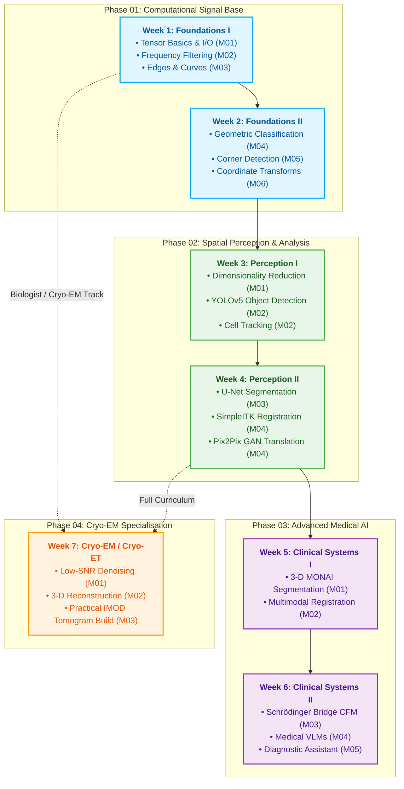
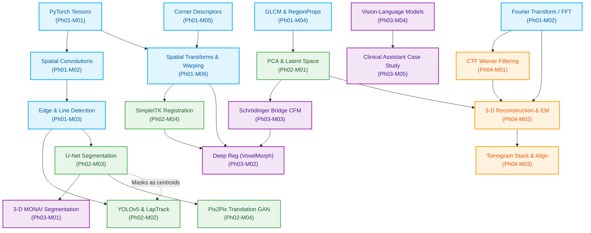

# Medical & Biological Imaging AI — Tutorial Series

A four-phase, hands-on curriculum that takes you from first principles in signal processing all the way to clinical 3-D segmentation, generative synthesis, vision-language models, and real cryo-electron tomography. Every notebook runs on Google Colab (free T4 GPU), and each phase builds deliberately on the one before it.Besides, you are encouraged to pull a issue in this repo.

---

## Who this is for

| Background | Where to start |
|------------|----------------|
| Python user curious about medical AI | Phase 01 → Phase 02 → Phase 03 |
| Biologist wanting to understand cryoEM computation | Phase 01 (Module 02) → Phase 04 |
| ML practitioner new to medical imaging | Phase 02 → Phase 03 |
| Structural biology researcher / cryo-ET newcomer | Phase 04 (after Phase 01 Module 02) |

---

## 🗺️ Full Roadmap

```
Phase 01 — Computational Signal Base
  ├─ 01 PyTorch Tensor Basics & Image I/O
  ├─ 02 Frequency Filtering & Image Pyramids
  ├─ 03 Classical Feature Extraction (Edges, Lines, Curves)
  ├─ 04 Geometry-Based Classification of Bio-Images
  ├─ 05 Corner Detection & Feature Descriptors
  └─ 06 Spatial Transformations & Image Warping

Phase 02 — Spatial Perception & Analysis
  ├─ 01 Dimensionality Reduction & Latent Space (PCA)
  ├─ 02 Object Detection & Tracking (YOLOv5 + LAP)
  ├─ 03 Image Segmentation (Watershed → U-Net)
  └─ 04 Image Alignment & Registration (SimpleITK + Pix2Pix)

Phase 03 — Advanced Medical AI
  ├─ 01 3-D Volumetric Segmentation with MONAI
  ├─ 02 Multimodal Image Registration
  ├─ 03 Medical Generative Models (Schrödinger Bridge CFM)
  ├─ 04 Medical Vision-Language Models (BiomedCLIP, BLIP-2, LLaVA)
  └─ 05 Clinical Diagnostic Assistant Case Study

Phase 04 — CryoEM & Structural Biology
  ├─ 01 Low-SNR Noise Processing & Particle Picking
  ├─ 02 3-D CryoEM Reconstruction
  └─ 03 Build & Diagnose a Real Cryo-ET Tomogram (EMPIAR-10164)
```

### 📅 Suggested 7-Week Timeline
To help you pace your learning, we have organized the 4 phases into a suggested **7-week schedule**:



### 🔗 Concept Connection Workflow
The curriculum is designed so that early mathematical foundations directly prepare you for later deep learning architectures and domain-specific applications. The diagram below illustrates how concepts and methods flow between modules:



### 💡 Why Learn in This Order?
Understanding *why* the curriculum is structured this way helps contextualize how simpler models build into clinical-grade applications:

* **Tensors & Warping to Deep Registration**: In Phase 01 Module 06, you build coordinate transformations and image warping from mathematical first principles. This exact logic is scaled in Phase 03 Module 02 (VoxelMorph), where a U-Net outputs a dense deformation field which is applied to a clinical scan using PyTorch's differentiable `grid_sample` (acting as a spatial transformer).
* **Fourier Transforms to Cryo-EM**: Frequency-domain filtering (Phase 01 Module 02) introduces the Fourier Transform. This is the direct prerequisite for Phase 04 (Cryo-EM), where you simulate the microscope's Contrast Transfer Function (CTF), denoise extremely low SNR micrographs, and reconstruct 3-D volumes using the Fourier Slice Theorem.
* **Classical Convolutions to Deep U-Nets**: Implementing Sobel and Canny edge detection by hand (Phase 01 Module 03) demystifies what convolutional neural network layers are actually doing. When training a U-Net for yeast cell segmentation (Phase 02 Module 03), you will realize the network learns these edge and feature kernels automatically via backpropagation.
* **Dimensionality Reduction to Generative Models**: Retinal image compression via PCA (Phase 02 Module 01) introduces the concept of a low-dimensional latent space. This prepares you to understand how modern generative models (Phase 03 Module 03 Schrödinger Bridge CFM) learn mapping trajectories between source and target latent representations.

---

## Phase Overview

### Phase 01 — Computational Signal Base
**Level: Beginner** · No prior PyTorch or image-processing experience required.

The foundation everything else rests on. You will leave Phase 01 fluent in PyTorch tensors, comfortable loading DICOM and TIFF medical images, and able to design and apply filters in both the spatial and frequency domains. The final module introduces hand-crafted geometric features and classical classifiers — still the right choice whenever labelled data is scarce.

➜ [`Phase01_ComputationalSignalBase/`](Phase01_ComputationalSignalBase/)

---

### Phase 02 — Spatial Perception & Analysis
**Level: Intermediate** · Requires Phase 01 or equivalent PyTorch familiarity.

Phase 02 is about understanding *where things are* and *what shape they have*. You will compress high-dimensional images with PCA, train a YOLOv5 object detector on a custom dataset, track cells across 3-D time-lapse volumes, segment structures with both classical algorithms and U-Net, and align image pairs using both iterative optimisation and a conditional GAN.

➜ [`Phase02_SpatialPerceptionAnalysis/`](Phase02_SpatialPerceptionAnalysis/)

---

### Phase 03 — Advanced Medical AI
**Level: Advanced** · Requires Phases 01 and 02.

The phase where individual building blocks converge into complete clinical-grade systems. You will train a 3-D U-Net on the Medical Segmentation Decathlon spleen benchmark, work through the full spectrum of multimodal registration from classical SimpleITK to deep VoxelMorph-style networks, synthesise missing imaging modalities using Schrödinger Bridge Conditional Flow Matching, and probe state-of-the-art foundation models (BiomedCLIP, BLIP-2, LLaVA-1.5) with real medical images.

➜ [`Phase03_AdvancedMedicalAI/`](Phase03_AdvancedMedicalAI/)

---

### Phase 04 — CryoEM & Structural Biology
**Level: Specialist** · Requires Phase 01 Module 02 (Fourier analysis) + NumPy/SciPy fluency.

An end-to-end computational treatment of cryo-electron microscopy. Module 01 builds the 2-D signal-processing intuition (CTF simulation, denoising, particle picking, class averaging, FRC resolution). Module 02 extends everything to 3-D: the Fourier Slice Theorem, trilinear back-projection, and expectation-maximisation pose estimation. Module 03 is a full hands-on practical using IMOD/Etomo on a real published tilt series from EMPIAR.

➜ [`Phase04_CryoEM_StructuralBiology/`](Phase04_CryoEM_StructuralBiology/)

---

## Prerequisites

| Tool | Phase needed | Notes |
|------|-------------|-------|
| Python 3.9+ | All | |
| NumPy, Matplotlib | All | |
| PyTorch | 01–04 | Covered from scratch in Phase 01 |
| Google Colab or local GPU | 02–04 | T4 (16 GB VRAM) sufficient for all notebooks |
| IMOD/Etomo | Phase 04 Module 03 only | Linux / macOS; install locally |

---

## How to Run

**Option A — Google Colab (recommended)**

Open any notebook directly in Colab by replacing `github.com` in the URL with
`colab.research.google.com/github`. Each notebook installs its own dependencies in the first cell.

**Option B — Local Jupyter**

```bash
git clone https://github.com/pastretender/edu.git
cd edu/Tutorials
pip install torch torchvision jupyterlab
jupyter lab
```

---

## Curriculum Map: Concepts and Their Modules

| Concept | First introduced | Used again in |
|---------|-----------------|--------------|
| PyTorch tensors | Ph01-M01 | Every subsequent module |
| Convolution / kernels | Ph01-M02 | Ph01-M03, Ph02-M03, Ph03-M01 |
| Fourier Transform | Ph01-M02 | Ph04-M01, Ph04-M02 |
| Edge & feature detection | Ph01-M03 | Ph02-M02, Ph02-M03 |
| GLCM / geometric features | Ph01-M04 | Ph02-M01 (motivation for PCA) |
| PCA / latent space | Ph02-M01 | Ph03-M03, Ph04-M02 |
| U-Net architecture | Ph02-M03 | Ph02-M04, Ph03-M01, Ph03-M02 |
| Similarity metrics (MI) | Ph02-M04 | Ph03-M02 |
| Dice loss | Ph02-M03 | Ph03-M01 |
| CTF | Ph04-M01 | Ph04-M02, Ph04-M03 |
| Expectation-Maximisation | Ph04-M02 | Ph04-M03 (production software) |

---

## Folder Structure

```
Tutorials/
├── README.md                          ← You are here
├── Phase01_ComputationalSignalBase/
│   ├── README.md
│   ├── 01_PyTorchTensorBasic/
│   ├── 02_FrequencyFiltering/
│   ├── 03_ClassicalFeatureExtract/
│   ├── 04_GeometryBasedClassification/
│   ├── 05_CornerDetection/
│   └── 06_SpatialTransformations/
├── Phase02_SpatialPerceptionAnalysis/
│   ├── README.md
│   ├── 01_DimensionReductionLatentSpace/
│   ├── 02_ObjectDetectTracking/
│   ├── 03_ImageSegmentation/
│   └── 04_ImageAlignmentRegister/
├── Phase03_AdvancedMedicalAI/
│   ├── Phase03_README.md
│   ├── 01_Volume3DSegmentation/
│   ├── 02_MultimodalRegistration/
│   ├── 03_MedicalGenerativeModel/
│   ├── 04_MedicalVisionLanguage/
│   └── 05_ClinicalDiagnosticAssistant/
└── Phase04_CryoEM_StructuralBiology/
    ├── Phase04_README.md
    ├── 01_LowSNRNoiseProcessing/
    ├── 02_3DCryoEMReconstruction/
    └── 03_TomogramDiagnosisBuild/
```

---

## Suggested Learning Paths

**"I want to work in medical imaging AI"**
Phase 01 (all) → Phase 02 (M01, M03, M04) → Phase 03 (M01, M02, M04)

**"I want to understand generative models for medical data"**
Phase 01 (M01, M02) → Phase 02 (M03, M04) → Phase 03 (M03)

**"I'm joining a cryoEM lab"**
Phase 01 (M01, M02) → Phase 04 (all, in order)

**"I want the full curriculum"**
Phase 01 → Phase 02 → Phase 03 → Phase 04
